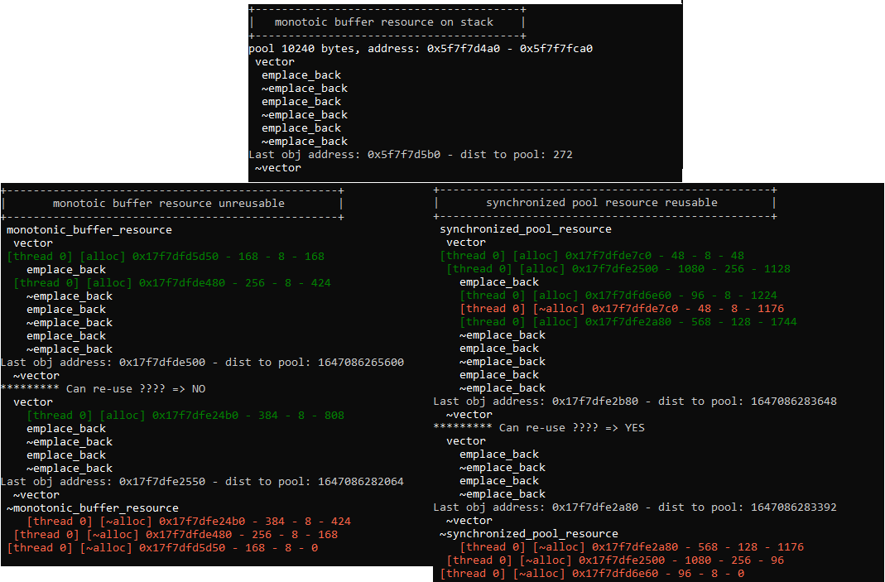

# [Polymorphic Memory Resource](https://en.cppreference.com/w/cpp/header/memory_resource)
Talks: [Pablo Halpern](https://www.youtube.com/watch?v=v3dz-AKOVL8) [David Sankel](https://www.youtube.com/watch?v=FLbXjNrAjbc) [Alisdair Meredith, Pablo Halpern](https://www.youtube.com/watch?v=RLezJuqNcEQ)
#### 1. Improve performance
* [`vector<string>` vs `pmr::vector<pmr::string>`](https://quick-bench.com/q/Xlx0Z07414WIVQlEiTzwgJ1McGw)
* [re-usable `pmr::vector<pmr::string>`](https://quick-bench.com/q/dC86LPj2bYMIFarp7IJMp1FCzKk)
* [Wrapper class `Foo` vs `FooPmr`](https://quick-bench.com/q/KSCL0iPFBCRlnLXJkMpXQT5Bq2M)
#### 2. Solve issues
...
#### 3. monotonic_buffer_resource vs (un)synchronized_pool_resource
[source](https://github.com/pvthuyet/cpp20-practise/blob/main/Cpp20Features/pmr.ixx)  

